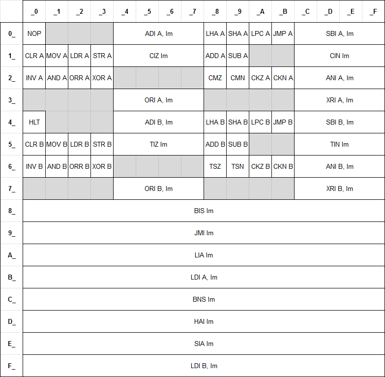

# Instruction Set



Every instruction is a single byte. There are two control bits separating them into three main
categories - 4-bit immediate, 2-bit immediate, and no immediate.

```
1xxxiiii - 4-bit immediate
0xxxx1ii - 2-bit immediate
0xxxx0xx - No immediate
```

Bit 6 is a pseudo-control bit, typically defining the (output) register of an instruction - 0 for
register A, 1 for register B. This is not a definite thing however, some instructions take it to
mean something else.

No immediate instructions can be split into further categories by bits 3-5:

```
0r0000xx - Misc
0r0010xx - Control
0r0100xx - Data
0r0110xx - Arithmetic
0r1000xx - Logical
0r1010xx - Comparative
0r1100xx - n/a
0r1110xx - n/a
```

#### Steps
All instructions (even invalid ones) use the same two final steps.

```
10 : PC Out, RAM Load Addr
11 : IR Load, RAM Out Val
```

Each instruction will list it's unique steps.

[Also see this sheet for a full map of all steps.](https://docs.google.com/spreadsheets/d/1a98A2vV9IfnqO3VQmyj6sGMfWKPg8c5xGqqqM8jQB3Q/edit?usp=sharing)
